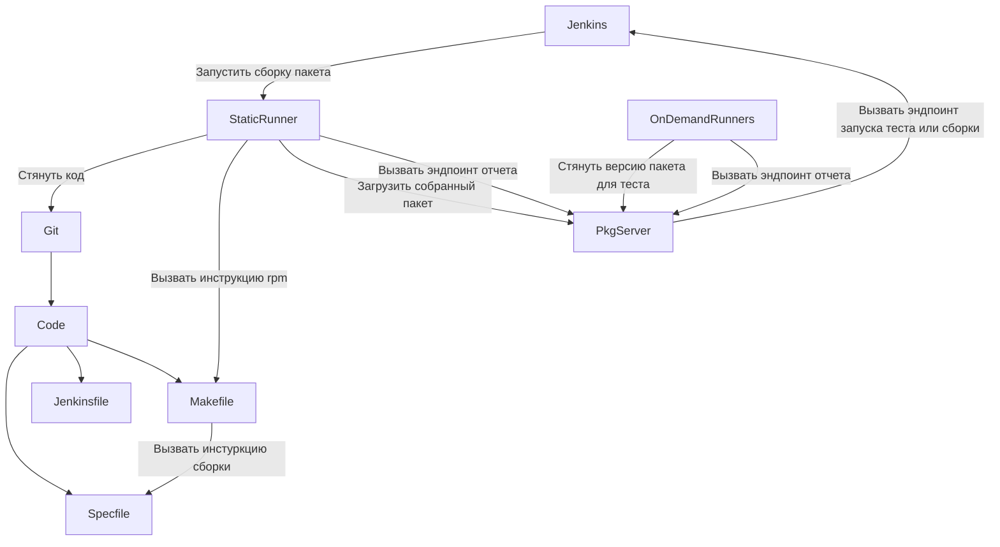
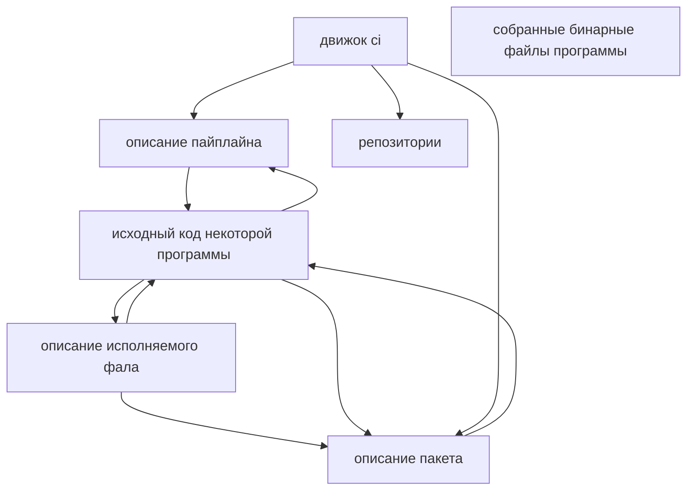

Когда через PRS является центром и через него можно вызвать внешний ci

```mermaid
graph TD
    Jenkins --> |Запустить сборку пакета| StaticRunner
    Git --> Code
    Code --> Specfile
    Code --> Jenkinsfile
    Code --> Makefile
    %% Specfile -->|Находиться рядом с исходниками|Git
    Jenkinsfile
    Makefile -->|Вызвать инстуркцию сборки|Specfile
    PkgServer -->|Вызвать эндпоинт запуска теста или сборки|Jenkins
    StaticRunner -->|Стянуть код|Git
    StaticRunner -->|Вызвать инструкцию rpm|Makefile
    StaticRunner -->|Загрузить собранный пакет|PkgServer
    StaticRunner -->|Вызвать эндпоинт отчета| PkgServer
    OnDemandRunners -->|Стянуть версию пакета для теста| PkgServer
    OnDemandRunners -->|Вызвать эндпоинт отчета| PkgServer
```

Когда CI являетя центром, а PRS только репозиторием собранных пакетов

```mermaid
graph TD
    ci[движок ci]
    code[исходный код некоторой программы]
    gharts[собранные бинарные файлы программы]
    cifile[описание пайплайна]
    spec[описание пакета]
    make[описание исполняемого фала]
    repo[репозитории]

    %% знает что тут же лежит спек и можно собрать из кода сразу пакет
    make --> spec

    %% код знает о себе самом
    make --> code
    spec --> code
    cifile --> code

    %% код хранит спек но и спек прям тут же работает с кодом?
    code --> spec
    code --> make
    code --> cifile

    ci --> repo
    ci --> cifile
    ci --> spec

    %% конец
```

cifile
    code
        make
    spec